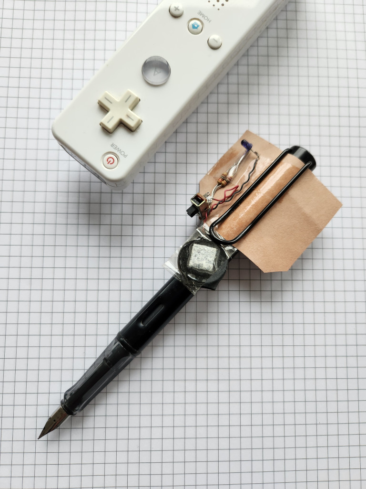

# Fokusier writing helper tool

Fokusier is a tool designed to enhance writing focus and productivity. By encouraging continuous writing, Fokusier helps you maintain flow and avoid distractions.

An infrared LED attached to your pen is tracked by the infrared camera of a Nintendo Wiimote. If you pause for an extended period, it prompts you to resume writing and maintain momentum.



# Dependencis


```
sudo apt-get install build-essential alsa-utils
```

# Building

Clone and build cwiid in the parent directory:

```
git clone https://github.com/pd-l2ork/cwiid.git libcwiid
cd libcwiid
<build cwiid>
cd ../fokusier
./build.sh
```
